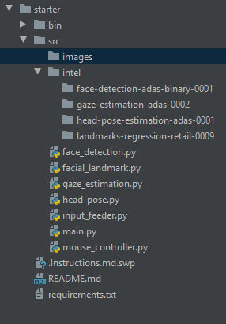
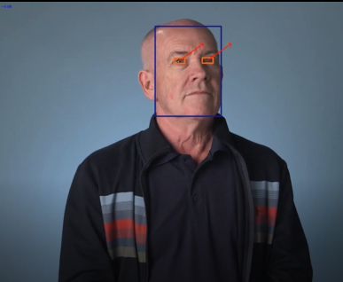
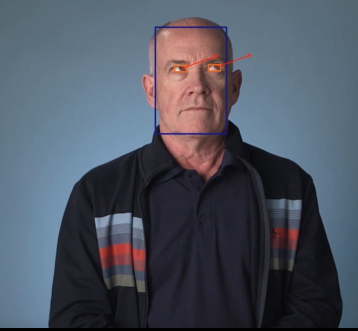

# Computer Pointer Controller

*TODO:* Write a short introduction to your project

## Project Set Up and Installation
1. Download [OpenVino ToolKit](https://software.intel.com/content/www/us/en/develop/tools/openvino-toolkit/choose-download.html) and install it locally.

2. Clone this repository from this URL: https://github.com/KMKnation/Computer-Pointer-Controller/tree/1.0.0

3. Create Virtual Enviorment in working directory.

        cd Computer-Pointer-Controller
        python3 -m venv venv

4. Activate Virtual Enviorment
        
        source venv/bin/activate
                
## Demo
From the [main](./src) directory run the command below and it automatically runs with all the default value
        
        python main.py 

To run with a custom value you have to explicitly specify the value with the instruction provided below
## Documentation
###### Directory structure

All argument have been made optional so it can successfully run the default configuration, even a default video have been provided
###### Command line Arguments
Argument|Description
| ------------- | -------------|
|-m_fd|Path to the face detection model
|-m_pe|Path to the head pose estimation model
|-m_fl|Path to the facial landmark detector model
|-m_ge|Path to the gaze estimation model
|-i|This could either be a video,image or 'cam'
|-sv|Save the image or video file to the current directory
|-d|Device used for inference
|-dl|For drawing the visualisation lines

To perform inference directly from a camera source specify 'cam' as the input

## Benchmarks
#### Model load time (milliseconds)
|Model|FP16|FP32|
|----|----|----|
|head-pose-estimation-adas-0001|109|123|
|landmarks-regression-retail-0009|48|49|
|gaze-estimation-adas-0002|134|118|

#### Model Inference time (milliseconds)
|Model|FP16|FP32|
|----|----|----|
|head-pose-estimation-adas-0001|6.07|3.07|
|landmarks-regression-retail-0009|0.88|1.13|
|gaze-estimation-adas-0002|41.2|41.7|

## Results
FP32 is single-precision floating-point arithmetic (uses 32 bits to represent numbers), FP16 is half-precision (uses 16 bits).

You can represent numbers more accurately using FP32, but the training for FP32 is big and slow.
since you don't need much precision to do deep learning you can use FP16 instead of FP32 in a deep learning model to reduce the time and energy spent computing, at little/no cost in accuracy.

Using the result gotten above Both models could be use interchangeably without having a signifacant
difference in the load time and inference time but FP16 should have a less storage space, memory bandwidth, power consumption,
lower inference latency and higher arithmetic speed because FP16 only occupies 16 bits in memory rather than 32 bits,

### Edge Cases
When more faces are detected(uses the first face detected only and prints out error).
When user inputs a wrong file(gives error).
User trying to save result from web cam

